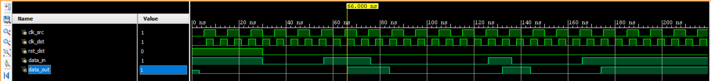
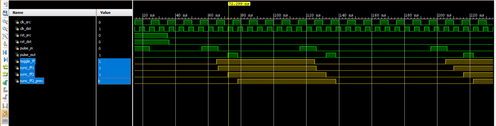
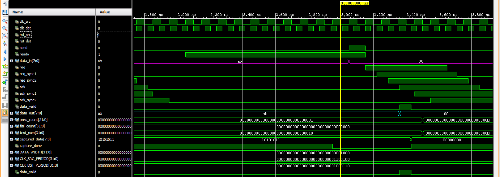
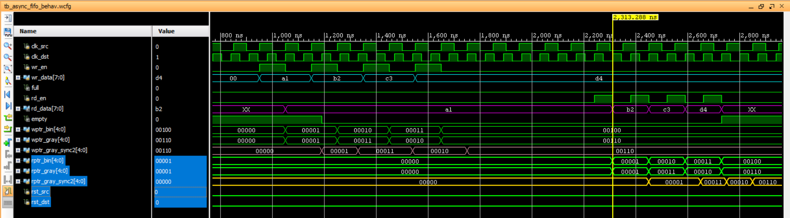

# CDC Techniques for Reliable Data T

This project implements and evaluates multiple Clock Domain Crossing (CDC) techniques in Verilog HDL to enable reliable data transfer between asynchronous clock domains. The project includes RTL design, functional verification using dedicated testbenches, and waveform analysis.


---

## Project Overview

Clock Domain Crossing (CDC) is a fundamental challenge in digital system design whenever signals are transferred between modules operating on different clock frequencies. Improper synchronization may lead to metastability, resulting in unreliable system behavior.

This project demonstrates four widely used CDC techniques by implementing synthesizable RTL modules and verifying their functionality through simulation.

---

## Key Highlights

- Implemented four widely used Clock Domain Crossing (CDC) techniques in synthesizable Verilog HDL.
- Developed modular RTL designs for independent CDC implementations.
- Verified functionality through dedicated simulation testbenches.
- Evaluated waveform behavior across asynchronous clock domains.
- Organized the project using reusable RTL modules and structured verification.

---

## Implemented CDC Techniques

| Module | Description |
|---------|-------------|
| **2-Flop Synchronizer** | Synchronizes single-bit control signals while minimizing metastability. |
| **Pulse Synchronizer** | Transfers short-duration pulses across asynchronous clock domains. |
| **Handshake Synchronizer** | Transfers multi-bit data using a request–acknowledge handshake protocol. |
| **Asynchronous FIFO** | Enables reliable continuous data transfer between independent clock domains using Gray-code pointer synchronization. |

---

## Simulation Results

### 2-Flop Synchronizer



### Pulse Synchronizer



### Handshake Synchronizer



### Asynchronous FIFO



---

## Tools Used

- Verilog HDL
- Xilinx Vivado Simulator
- Digital Logic Design
- Clock Domain Crossing (CDC)

---

## Repository Structure

```text
CDC-Techniques-for-Reliable-Data-Transfer
│
├── images/         Block diagrams used in the README
├── rtl/            Verilog HDL source files
├── tb/             Simulation testbenches
├── waveforms/      Simulation waveform screenshots
└── README.md
```

---

## Project Outcomes

- Implemented and verified four industry-standard Clock Domain Crossing (CDC) techniques.
- Demonstrated reliable single-bit, pulse-based, handshake-based, and FIFO-based data transfer across asynchronous clock domains.
- Validated functionality through behavioral simulation and waveform analysis.
- Designed reusable and modular RTL blocks suitable for integration into larger digital systems.

---

## Author

**Samarpan Acharya**

B.Tech • Electronics and Communication Engineering

National Institute of Technology Rourkela

---

> **Note:** This repository is intended for educational purposes and demonstrates practical RTL implementation and functional verification of commonly used Clock Domain Crossing (CDC) techniques in digital system design.
---
