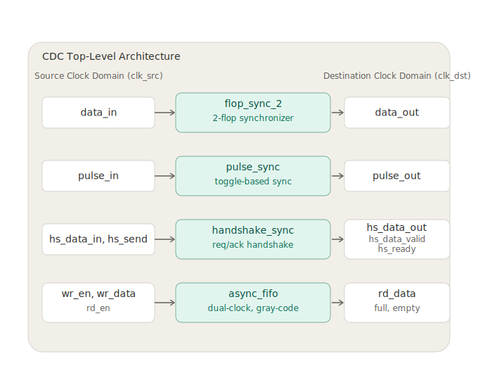

# CDC Techniques for Reliable Data Transfer

This project implements and evaluates multiple Clock Domain Crossing (CDC) techniques in Verilog HDL to enable reliable data transfer between asynchronous clock domains. The project includes RTL design, verification using testbenches, and waveform analysis.
## Overview

Clock Domain Crossing (CDC) is a fundamental challenge in digital system design whenever signals are transferred between modules operating on different clock frequencies. Improper synchronization may lead to metastability and unreliable system behavior.

This project demonstrates several commonly used CDC techniques and compares their behavior through simulation using Verilog HDL.
## Features

- Implementation of multiple Clock Domain Crossing (CDC) techniques
- RTL design in Verilog HDL
- Functional verification using dedicated testbenches
- Waveform analysis for signal verification
- Modular and reusable hardware design

## Project Structure

```text
CDC-Techniques-for-Reliable-Data-Transfer
│
├── docs/          
├── images/         
├── reports/    
├── rtl/     
├── tb/
├── waveforms/
└── README.md
```
## Block Diagram


## Implemented CDC Techniques

This project demonstrates four commonly used Clock Domain Crossing (CDC) techniques for reliable communication between asynchronous clock domains.

| Module | Purpose |
|---------|---------|
| 2-Flop Synchronizer | Synchronizes single-bit control signals while reducing metastability. |
| Pulse Synchronizer | Transfers short pulses safely between different clock domains. |
| Handshake Synchronizer | Reliably transfers multi-bit data using a request-acknowledge protocol. |
| Asynchronous FIFO | Enables continuous multi-bit data transfer between independent clock domains using Gray-code pointers. |
